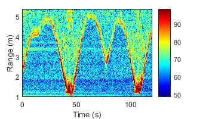
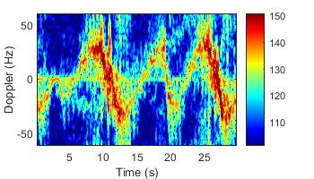

# Micro-Doppler Spectrogram Computation of PulsON P410 Radar from TimeDomain (Humatics)

_This example project computes a micro-Doppler spectrogram from a real or a complex range-time matrix of the PulsON P410 radar from TimeDomain (Humatics)._

## Process Flow Illustration
 → 

## Files and Functions in the Project
### Main Files
* `main_stft_p410_public.m`
* `main_stft_p410_network_public.m`

### Functions
* `fct_rt_matrix_real_to_complex.p`
* `fct_stft_pulson_radar.p`

### Example Data
* `ex_rangeTimeMap.mat`

## To `main_stft_p410_public.m`
This function `main_stft_p410_public.m` computes the micro-Doppler spectrogram from the example data `ex_rangeTimeMap.mat` using the two functions (`fct_rt_matrix_real_to_complex.p`, `fct_stft_pulson_radar.p`) for computing the complex range-time matrix and generating the micro-Doppler spectrogram.

## To `main_stft_p410_network_public.m`
This function `main_stft_p410_network_public.m` computes the micro-Doppler spectrograms from all radars in the network when using the public data: [`https://doi.org/10.4121/16691500`](https://doi.org/10.4121/16691500). It utilizes the two functions (`fct_rt_matrix_real_to_complex.p`, `fct_stft_pulson_radar.p`) for computing the complex range-time matrices and generating the micro-Doppler spectrograms, including the provided label vector.

<span style="color:red; font-weight:bold;">
Note: When using this code or the data, we would appreciate proper citation of our work using the references provided below.
</span>


## References
1. R. G. Guendel, M. Unterhorst, E. Gambi, F. Fioranelli and A. Yarovoy, "Continuous human activity recognition for arbitrary directions with distributed radars," in 2021 IEEE Radar Conference (RadarConf21), Atlanta, GA, USA, 2021, pp. 1-6, doi: [10.1109/RadarConf2147009.2021.9454972](https://doi.org/10.1109/RadarConf2147009.2021.9454972).

2. Guendel, R.G., Fioranelli, F., Yarovoy, A.: Distributed radar fusion and recurrent networks for classification of continuous human activities. IET Radar Sonar Navig. 16(7), 1144–1161 (2022). [https://doi.org/10.1049/rsn2.12249](https://doi.org/10.1049/rsn2.12249)

3. Guendel, Ronny Gerhard; Unterhorst, Matteo; Fioranelli, Francesco; Yarovoy, Alexander (2021): Dataset of continuous human activities performed in arbitrary directions collected with a distributed radar network of five nodes. 4TU.ResearchData. Dataset. [https://doi.org/10.4121/16691500](https://doi.org/10.4121/16691500)

BibTeX:
```bib
@INPROCEEDINGS{9454972,
      author    ={Guendel, Ronny Gerhard and Unterhorst, Matteo and Gambi, Ennio and Fioranelli, Francesco and Yarovoy, Alexander},
      booktitle ={2021 IEEE Radar Conference (RadarConf21)}, 
      title     ={Continuous human activity recognition for arbitrary directions with distributed radars}, 
      year      ={2021},
      pages     ={1-6},
      doi       ={10.1109/RadarConf2147009.2021.9454972}}

@article{https://doi.org/10.1049/rsn2.12249,
      author    = {Guendel, Ronny G. and Fioranelli, Francesco and Yarovoy, Alexander},
      title     = {Distributed radar fusion and recurrent networks for classification of continuous human activities},
      journal   = {IET Radar, Sonar and Navigation},
      volume    = {16},
      number    = {7},
      pages     = {1144-1161},
      year      = {2022},
      doi       = {10.1049/rsn2.12249}}

@misc{Guendel2022, 
    author     = {Guendel, Ronny and Unterhorst, Matteo and Fioranelli, Francesco and Yarovoy, Alexander},
    title      = {Dataset of continuous human activities performed in arbitrary directions collected with a distributed radar network of five nodes},
    year       = {2021}, 
    month      = {Nov}, 
    url        = {https://doi.org/10.4121/16691500}, 
    doi        = {10.4121/16691500}} 
